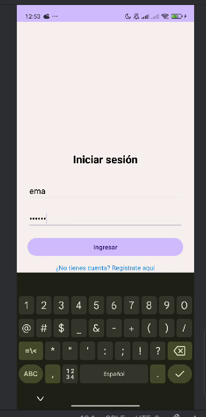
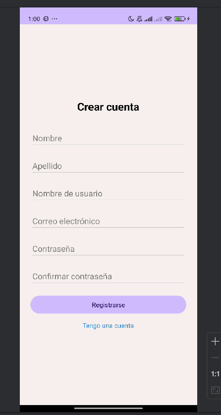
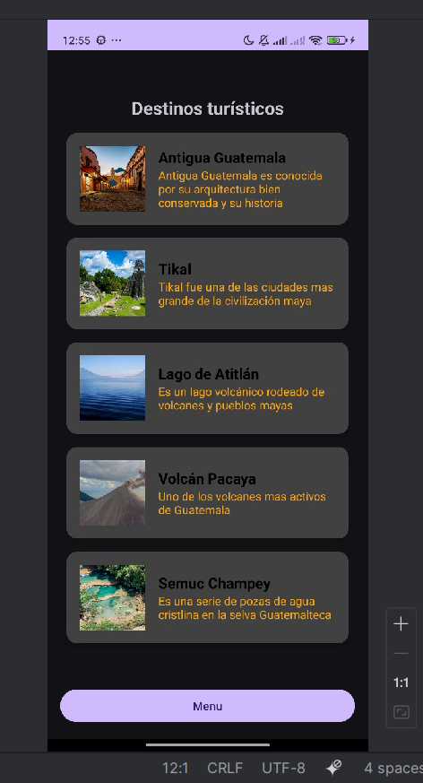
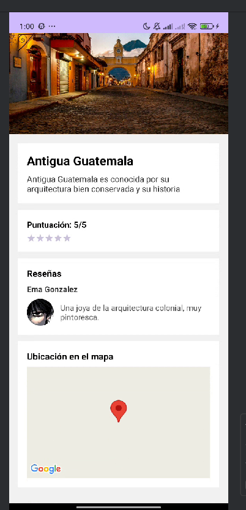
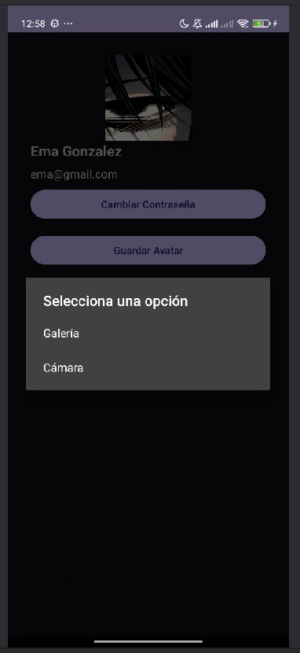
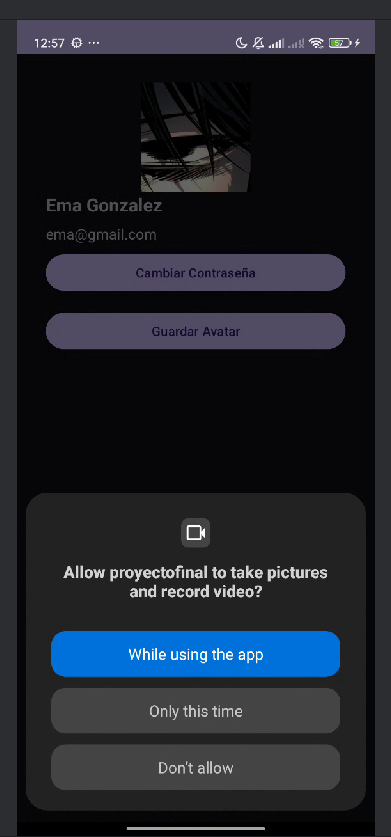

# Tourism Mobile App | Aplicación Móvil de Turismo

Aplicación móvil de turismo desarrollada en Android con Kotlin, arquitectura MVVM, Retrofit y Google Maps API.

Android tourism mobile application built with Kotlin, MVVM architecture, Retrofit and Google Maps API.

---
## Capturas de pantalla | Screenshots

<p align="center">
  
  
  
</p>

<p align="center">
  
  
  
</p>

<p align="center">
  
  
</p>

---

## Características | Features

- Registro de usuarios  
  User registration

- Inicio de sesión  
  User login

- Visualización de destinos turísticos  
  Tourist destination listing

- Detalle de destinos turísticos  
  Tourist destination details

- Integración con Google Maps  
  Google Maps integration

- Configuración de avatar de perfil  
  Profile avatar configuration

- Consulta de perfil de usuario  
  User profile view

- Cambio de contraseña  
  Password update

- Consumo de API REST propia  
  Custom REST API consumption

- Arquitectura MVVM  
  MVVM architecture

---

## Tecnologías | Technologies

- Kotlin
- Android Studio
- MVVM
- Retrofit
- Google Maps API
- RecyclerView
- REST API

---

## Backend relacionado | Related Backend

Este proyecto se conecta con el backend en mi repositorio:

This project connects with the backend in my repository:

```txt
tourism-app-backend
```


---

## Autor | Author

Emanuel Gonzalez
